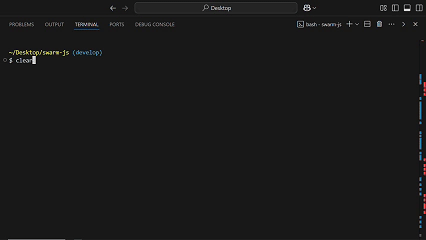

# Swarm JS



**Swarm JS** is an experimental framework for orchestrating multiple AI "agents" that can transfer control to each other and call functions (or "tools") in a chat-based workflow. It uses the [OpenAI Node.js library][openai-npm], along with a few utilities, to facilitate multi-step reasoning and delegation across different agents with specialized instructions.

## Table of Contents

- [Features](#features)
- [Installation](#installation)
- [Usage](#usage)
  - [1. Creating Agents](#1-creating-agents)
  - [2. Defining Tools](#2-defining-tools)
  - [3. Running the Swarm](#3-running-the-swarm)
  - [4. Example Usage](#4-example-usage)
- [API Reference](#api-reference)
  - [`SwarmJS` Class](#swarmjs-class)
  - [`Agent` Class](#agent-class)
  - [`Response` Class](#response-class)
  - [`run_demo_loop` Function](#run_demo_loop-function)
- [Environment Variables](#environment-variables)
- [How It Works](#how-it-works)
- [Contributing](#contributing)
- [License](#license)

---

## Features

- **Multi-agent orchestration**: Define multiple agents, each with its own role, instructions, and tools.
- **Tool calling**: Agents can call functions you provide ("tools") to perform specific tasks such as database lookups, refunds, or any custom logic.
- **Agent transfer**: Agents can return another agent to "transfer control" of the conversation.
- **Automatic parameter extraction**: Tools can be annotated for their parameters, which helps create function calling schemas automatically.
- **Interactive spinner and logs**: Uses [ora][ora-npm] and [chalk][chalk-npm] to display helpful CLI feedback.

---

## Installation

```bash
npm install swarm-js
```

> **Note**: Swarm JS depends on the [OpenAI Node.js library][openai-npm], which is installed as a dependency. Make sure to have a valid OpenAI API key to use its features.

---

## Usage

Below is a quick overview of how to set up and use Swarm JS in your Node.js or TypeScript project.

### 1. Creating Agents

An **Agent** represents an AI persona or "role" in your application. You can create as many agents as you like, each with its own `name`, `model`, `instructions`, and `tools`.

```js
import { Agent } from 'swarm-js';

const triage_agent = new Agent({
  name: 'Triage Agent',
  model: 'gpt-4o-mini',
  instructions: `
    Analyze the user's request and determine the appropriate course of action.
    - If the request involves a refund, first obtain the item ID from the Inventory Agent.
    - After obtaining the item ID, transfer to the Refunds Agent to process the refund.
    - Ensure that all necessary information is gathered before processing.
  `,
  tools: [] // will add tools later
});
```

### 2. Defining Tools

"Tools" are just JavaScript functions, but you can annotate them with a `.doc` property to describe what they do. **Swarm JS** automatically converts each tool into a JSON schema for function calling in the OpenAI API.  

A tool can optionally transfer conversation control by returning another `Agent` instance.

```js
function look_up_item(search_query) {
  // Use search_query to find an item
  return "item_00000";
}
look_up_item.doc = `Use to find an item ID. Search query can be a description or keywords.`;

function execute_refund(item_id, reason = "not provided") {
  // Issue refund logic
  console.log(`Refunding ${item_id}. Reason: ${reason}`);
  return "Success";
}
execute_refund.doc = `Use to issue a refund by item ID.`;

function transfer_back_to_triage() {
  // Returns an Agent instance to transfer control back to the triage agent
  return triage_agent;
}
transfer_back_to_triage.doc = `
  Call this function if a user is asking about a topic 
  that is not handled by the current agent.
`;

// Attach these tools to agents
triage_agent.tools = [ /* ...some tools... */ ];
```

### 3. Running the Swarm

`SwarmJS` manages the conversation loop with OpenAI. It:
1. Sends messages to OpenAI.
2. Receives potential function calls from the model (i.e., "tool calls").
3. Executes those calls (if applicable).
4. Allows agents to transfer to different agents.

```js
import { SwarmJS } from 'swarm-js';

const swarm = new SwarmJS(); 

async function runChatFlow() {
  const messages = [{ role: 'user', content: 'I would like to return a Christmas tree.' }];
  const response = await swarm.run(
    triage_agent, // the initial agent
    messages     // the conversation so far
  );
  console.log(response);
}

runChatFlow();
```

### 4. Example Usage

Below is a more complete example with three agents (`Triage Agent`, `Inventory Agent`, and `Refunds Agent`) and the relevant tools:

```js
import { Agent, SwarmJS } from 'swarm-js';

// Define your agents
const triage_agent = new Agent({
  name: 'Triage Agent',
  model: 'gpt-4o-mini',
  instructions: `
    Analyze the user's request and determine the appropriate course of action.
    - If the request involves a refund, first obtain the item ID from the Inventory Agent.
    - After obtaining the item ID, transfer to the Refunds Agent to process the refund.
    - Ensure that all necessary information is gathered before processing.
  `,
  tools: [] // we'll populate this later
});

const inventory_agent = new Agent({
  name: 'Inventory Agent',
  model: 'gpt-4o-mini',
  instructions: `
    Assist with finding item IDs for refunding items, then transfer back to triage.
  `,
  tools: []
});

const refunds_agent = new Agent({
  name: 'Refunds Agent',
  model: 'gpt-4o-mini',
  instructions: `
    Assist with issuing refunds using an item ID, then transfer back to triage.
  `,
  tools: []
});

// Define your tools
function look_up_item(search_query) {
  return "item_00000";
}
look_up_item.doc = `Use to find an item ID. Search query can be a description or keywords.`;

function execute_refund(item_id, reason = "not provided") {
  console.log(`Refunding ${item_id}. Reason: ${reason}`);
  return "Success";
}
execute_refund.doc = `Use to issue a refund by item ID.`;

// Transfers
function transfer_back_to_triage() {
  return triage_agent;
}
transfer_back_to_triage.doc = `Transfers the conversation back to Triage Agent.`;

function transfer_to_inventory_agent() {
  return inventory_agent;
}
transfer_to_inventory_agent.doc = `Transfers the conversation to Inventory Agent.`;

function transfer_to_refunds_agent() {
  return refunds_agent;
}
transfer_to_refunds_agent.doc = `Transfers the conversation to Refunds Agent.`;

// Attach the tools
triage_agent.tools = [ transfer_to_inventory_agent, transfer_to_refunds_agent ];
inventory_agent.tools = [ look_up_item, transfer_back_to_triage ];
refunds_agent.tools = [ execute_refund, transfer_back_to_triage ];

// Run the swarm
(async () => {
  const swarm = new SwarmJS();
  const initial_messages = [
    {
      role: 'user',
      content: 'I would like to return a Christmas tree.'
    }
  ];
  
  const response = await swarm.run(triage_agent, initial_messages);
  console.log(response.messages);
})();
```

---

## API Reference

### `SwarmJS` Class

```ts
constructor({ openai }?: { openai?: OpenAI });
```

- Creates a new instance of the **SwarmJS** orchestrator.  
- Optionally accepts an `OpenAI` client instance. If not provided, it defaults to using the `OPENAI_API_KEY` environment variable.

#### `run(agent: Agent, messages: ChatCompletionMessage[]): Promise<Response>`

- Begins a conversation loop with the provided `agent` and list of `messages`.
- In each step, it sends the conversation to OpenAI, checks for any tool calls, executes them, and updates the conversation accordingly.
- Returns a `Response` object upon completion.

---

### `Agent` Class

```ts
class Agent {
  constructor({
    name?: string;
    model?: string;
    instructions?: string;
    tools?: Function[];
  });
}
```

- Represents an AI persona, with:
  - **name**: A friendly identifier for this agent.
  - **model**: The name of the LLM to use (e.g., `"gpt-4o-mini"`).
  - **instructions**: System instructions or a "persona" description for the agent.
  - **tools**: An array of functions that can be called by the agent.

#### `Agent.is_agent(obj: any): boolean`

- Returns `true` if `obj` is an instance of `Agent`.

---

### `Response` Class

```ts
class Response {
  agent: Agent;
  messages: ChatCompletionMessage[];
  constructor({ agent, messages }?: { agent?: Agent; messages?: ChatCompletionMessage[] });
}
```

- A simple response wrapper that includes:
  - **agent**: The final agent context after all transfers.
  - **messages**: The entire chat history.

---

### `run_demo_loop` Function

```ts
async function run_demo_loop(initial_agent: Agent): Promise<void>;
```

- An example/demo function that initializes a `SwarmJS` instance, runs a short conversation (with a single user request), and writes the resulting messages to a file (`eg-run.md`).
- This demonstrates how to use **SwarmJS** in a simple loop.

---

## Environment Variables

- **`OPENAI_API_KEY`**: If you do not provide a custom OpenAI client to the `SwarmJS` constructor, it will look for this environment variable to authenticate with the [OpenAI API][openai-api].

---

## How It Works

1. **Agent & Tools**: You define one or more agents (via the `Agent` class), each containing:
   - A unique name
   - Custom instructions
   - A list of "tool" functions, each annotated with `.doc` for usage hints

2. **Parameter Extraction**: Swarm JS automatically converts these tools into JSON schemas that the OpenAI function-calling API can understand.  
   - It does this by analyzing the function signature and any default parameter values or docstrings.

3. **Conversation Loop**:
   - The user messages (along with system instructions) are sent to OpenAI.
   - OpenAI may request to call a tool function by name, with arguments derived from the conversation.
   - Swarm JS executes the tool function and appends the result to the conversation.
   - The conversation continues until no more tool calls are requested.

4. **Agent Transfer**: If a tool returns another `Agent` instance, the conversation "transfers" to that agent. Subsequent steps in the conversation use the new agent's instructions and tools.

---

## Contributing

Contributions, suggestions, and feedback are welcome! You can:
- Fork the repository
- Create a feature branch
- Submit a pull request

---

## License

MIT License. See [LICENSE](./LICENSE) for details.

---

[openai-npm]: https://www.npmjs.com/package/openai
[openai-api]: https://platform.openai.com/docs/api-reference
[ora-npm]: https://www.npmjs.com/package/ora
[chalk-npm]: https://www.npmjs.com/package/chalk
